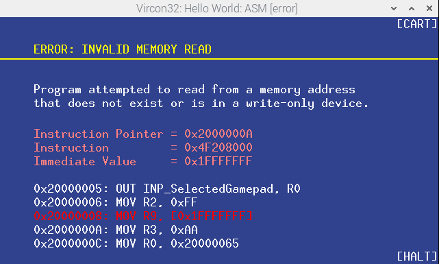

# CUSTOM BIOS: BiosWithoutLogoDebug FOR VIRCON32 CONSOLE

What is this?

This is a custom BIOS program for the Vircon32 console. Its functions are
the same as the standard BIOS but at the start it shows no logo and plays
no sound. Instead it begins execution  right away. This BIOS is not meant
for regular console  use. It is instead directed to  developers, who will
often do frequent changes and tests. This BIOS will save them the time of
waiting for the logo every single time they do a new test.
    
This BIOS  is a  modified version  of the  'BiosWithoutLogo' BIOS  in the
ConsoleSoftware  Vircon32 repository.  It essentially  just adds  in some
support functions (for instruction decoding)  and modifies the data to be
ultimately displayed to the error message screen.

The intent  is for it  to be more useful  in ASM debugging  endeavours- a
fair bit  easier to see  the source of  the problem versus  constantly in
need of decoding the instruction data you are provided in hex.

-----------------------------------------------------------------------------

## Screenshot



-----------------------------------------------------------------------------

## Additions

The following is an overview of the changes made to `BiosWithoutLogo` for
any deeper investigations:

The  addition  of  a  struct   called  `string_data`  to  store  assembly
instruction mneumonics  and portnames  that are  displayed. Also  used to
display the memory section of the error.

Due   to   an   issue   with  the   Vircon32   `itoa()`   function   (see
https://github.com/vircon32/ComputerSoftware/issues/16),   any   DevTools
release v25.1.19 or prior has  a broken `itoa()` implementation that will
prevent the display of negative values  in most bases. As our custom BIOS
makes extensive  use of `itoa()`  to display hexadecimal values,  a fixed
version  called `itoa2()`  is present  in the  file that  will allow  the
display of ALL valid hexadecimal values.

The  `decode_instruction()` function  takes  the  instruction hex  value,
provided  immediate value,  and the  desired y  position and  renders the
assembly  instruction. This  is the  main value-added  workhorse of  this
BIOS.

-----------------------------------------------------------------------------

## Modifications / Changes

The   bulk   of   changes   to  existing   functions   takes   place   in
`error_handler()`, where we determine not  only the instruction at issue,
but we display the  previous two leading up to it,  and the following two
after it, for a nice contextual display of debugging information.

The offset of each instruction is  also displayed, which can be used with
the assembler's  `-g` argument to locate  the specific place in  the code
where the problem is taking place.

-----------------------------------------------------------------------------

## To-Do / Limitations

Bounds  checking  is  not  complete   in  the  current  version.  If  the
prior  instructions fall  below the  current memory  region, or  the next
instructions are beyond  it, no restriction is  currently performed (such
scenarios would  likely cause  invalid output or  throw a  machine access
error).

Port  name translations  are now  performed, however  the "Command"  port
options are  not translated: you  will just get  the raw hex  value. This
should still be more than good  enough to help you locate the instruction
in question.

Obviously  our decoding  will  not  know about  any  of your  established
labels. You will just see raw hex offsets. No way around this.

No  decoding  will  be  done for  BIOS-originating  errors,  for  obvious
reasons.

-----------------------------------------------------------------------------

## Configuring Vircon32 to use a custom BIOS

By default,  Vircon32 will use  the Bios/StandardBios.v32 located  in the
Vircon32 Emulator directory.

To best utilize a custom BIOS:

* copy the custom BIOS (under a unique name) into the Bios/ directory.
* open `Config-Settings.xml` and edit the  `<bios file=` entry

-----------------------------------------------------------------------------

## Embedding BIOS debug subroutines for ready access

If  you had  your  own  custom debug  subroutine,  to facilitate  access,
it   could  be   added  to   the  BIOS   data.  This   will  be   a  very
implementation-specific use  case, but  here is what  we have  settled on
doing for our purposes:

Three debug subroutines (located in a file called `debug.asm`:
* `_debug`: display of a word of data (in hex) at a given x and y
* `_debugmemory`: display of a range of memory addresses
* `_debugregs`: display of the register array
    
After  compiling,  but before  assembling,  append  the contents  of  the
`debug.asm` to the compiler-generated assembly output:

* `cat ../debug/debug.asm >> obj/BiosWithoutLogoDebug.asm`

When assembling, add  the `-g` argument to generate  the debugging output
file during the `assemble` step:

* `assemble obj/BiosWithoutLogoDebug.asm -o obj/BiosWithoutLogoDebug.vbin -b -g`

This simple addition can be made to the existing logic in `Make.sh`.

Continue build  process as usual.  Upon completion, we can  generate some
assembly-style  defines automatically  with  the  following bash  snippet
(assumes that all the debug routines start with `_debug` and there are no
additional references):

```
declare -a NAME
NAME[0]=
NAME[1]="MEM"
NAME[2]="REGS"
index=0
for entry in `cat obj/BiosWithoutLogoDebug.vbin.debug | grep '\<_debug' | cut -d',' -f1,4`;
do
    offset=$(echo "${entry}" | cut -d',' -f1)
    echo "%define DEBUG${NAME[${index}]} ${offset}"
    let index=index+1
done
```
    
This `%define` output can be added to your own assembly files, to be used
to call upon easily by the symbolic names:

* `call DEBUG`
* `call DEBUGMEM`
* `call DEBUGREGS`

If using C, with assembly debug routines (again, our specific situation),
writing some C  wrapper functions can be  done. In the case  of our DEBUG
(which takes 3  parameters- the value to  display, the x, and  the y; the
updated X coordinate is returned):

```
int debug (int value, int x, int y)
{
    asm
    {
        "mov R5, {value}" // pick some high register
        "push R5"
        "mov R5, {x}"
        "push R5"
        "mov R5, {y}"
        "push R5"
        "call 0x10001D54" // the output offset from the bash snippet
        "pop R5"
        "mov {x}, R5"
    }
    return (x);
}
```

-----------------------------------------------------------------------------

## Credits

All  existing  credits  for  the  `BiosWithoutLogo`  BIOS,  with  further
modifications from:

* Matthew Haas (@wedge1020)
* Thomas Kastner (@t0mmyka)
* Connor Grant (@Cgrant2)
* Brandon Dildine (@BDildine)

...  as part  of our  spring2025  semester explorations  in our  Computer
Organization class at SUNY Corning Community College.

-----------------------------------------------------------------------------

## License

This program  is free and open  source. It is offered  under the 3-Clause
BSD License, which full text is the following:
    
Copyright 2024-2025  SUNY Corning  Community College  spring2025 Computer
Organization class. All rights reserved.
    
Redistribution  and use  in  source  and binary  forms,  with or  without
modification, are  permitted provided  that the following  conditions are
met:
    
1. Redistributions of source code must retain the above copyright notice,
this list of conditions and the following disclaimer.
    
2.  Redistributions in  binary form  must reproduce  the above  copyright
notice,  this list  of conditions  and  the following  disclaimer in  the
documentation and/or other materials provided with the distribution.
    
3.  Neither  the name  of  the  copyright holder  nor  the  names of  its
contributors may be used to endorse or promote products derived from this
software without specific prior written permission.
    
    THIS SOFTWARE IS PROVIDED BY THE COPYRIGHT HOLDERS AND
    CONTRIBUTORS "AS IS" AND ANY EXPRESS OR IMPLIED WARRANTIES,
    INCLUDING, BUT NOT LIMITED TO, THE IMPLIED WARRANTIES OF
    MERCHANTABILITY AND FITNESS FOR A PARTICULAR PURPOSE ARE
    DISCLAIMED. IN NO EVENT SHALL THE COPYRIGHT HOLDER OR
    CONTRIBUTORS BE LIABLE FOR ANY DIRECT, INDIRECT, INCIDENTAL,
    SPECIAL, EXEMPLARY, OR CONSEQUENTIAL DAMAGES (INCLUDING, BUT
    NOT LIMITED TO, PROCUREMENT OF SUBSTITUTE GOODS OR SERVICES;
    LOSS OF USE, DATA, OR PROFITS; OR BUSINESS INTERRUPTION)
    HOWEVER CAUSED AND ON ANY THEORY OF LIABILITY, WHETHER IN
    CONTRACT, STRICT LIABILITY, OR TORT (INCLUDING NEGLIGENCE OR
    OTHERWISE) ARISING IN ANY WAY OUT OF THE USE OF THIS SOFTWARE,
    EVEN IF ADVISED OF THE POSSIBILITY OF SUCH DAMAGE.
