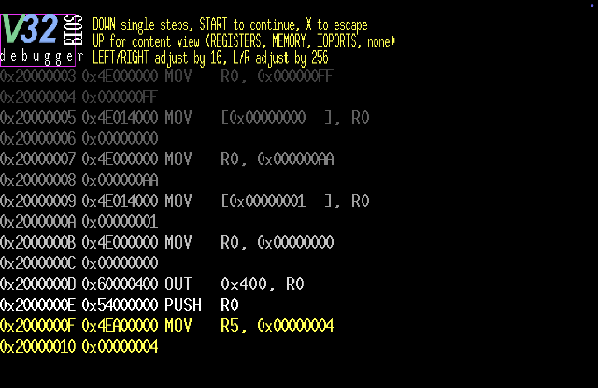

# debuggerBIOS

Release 20260506

A Vircon32 CustomBios with the intent to provide an interactive, built-in
debugger  for use  with troubleshooting  and studying  program logic.  It
strives to provide much-desired  debugging functionality via the Vircon32
emulation environment.

This BIOS is  based on v1.2 of the Vircon32  StandardBios, with liberties
taken to streamline  the start-up process by  removing the logo/animation
and sounds, and developed using v25.10.29 of the Vircon32 DevTools.

It is as much a pedagogical  tool as it is a conceptual proof-of-concept,
demonstrating functional viability of  an in-environment debugger and the
various schemes undertaken to pull it  off. It CAN actually be useful for
debugging,  if one  comes  in familiar  with  the necessary  prerequisite
knowledge.

## SCREENSHOTS

### STARTUP

On console start, single-stepping mode is enabled; it will stop and await
user input on the first instruction of the connected cartridge:


### STEPPING

Pressing `DOWN` executes  the current CART instruction,  then stopping on
the next awaiting user input:



### MEMORY VIEW

In addition to single-stepping instructions,  there are a set of resource
views that can be activated by pressing `UP` (register view, memory range
view, various IOPorts  views), which allows for further  insight into the
operation of the CART:


## BIOS

As part of Vircon32 operations, a  BIOS/firmware is needed to perform the
essential tasks of starting up the system and system error handling.

## OPERATION

The aim of  this CustomBios is to provide an  interactive debugger within
the Vircon32 environment for the purposes of debugging cartridge code, or
merely studying the operation of the system.

Functionality includes:

  * display of offset, machine code word, and decoded assembly code
  * single-stepping through assembly code (via `DOWN`)
  * continue mode (via `START`), allowing CART to run uninterrupted
    * debugger is still present, and single-step can be re-engaged
  * escape mode (`X` button), leaving the debugger entirely
  * user-cycled display of various system resources (via `UP`):
    * CART register array
    * console RAM (range adjustable)
    * CART stack
    * CART subroutine backtrace
    * TIM IOPorts
    * RNG IOPort
    * GPU IOPorts
    * SPU IOPorts
    * INP IOPorts
    * CAR IOPorts
    * MEM data (memory card)

Through  the  use  of  the  configured gamepad  (see  the  `#define`  for
`DEBUG_GAMEPAD` in  `debuggerBIOS.c`), various  debugger features  can be
utilized and accessed.

## LIMITATIONS

As a  BIOS, the debugger  is limited by the  what is provided  within the
Vircon32 environment. As such, debugging a  CART will be via machine code
decoded into assembly, where any  semblance of label or variable/function
naming has long been abstracted away.

Being  in-environment,  the debugger  has  no  greater access  to  system
resources than  any other BIOS or  CART running on the  system: no direct
access  to the  InstructionPointer, nor  the ability  to access  ports in
manners they aren't intended.

## CONFIGURING VIRCON32 TO USE A CUSTOM BIOS

By default, Vircon32 will use  the `Bios/StandardBios.v32` located in the
Vircon32 Emulator directory.

To best utilize a custom BIOS:

  * copy the custom BIOS (under a unique name) into the `Bios/` directory
  * open `Config-Settings.xml` and edit the  `<bios file=` entry

## FEATURES

debuggerBIOS   presents  the   following   features,   for  an   enriched
debugging-environment Vircon32 experience:

### SINGLE STEP

Pressing `DOWN`  on the  gamepad will  execute the  currently highlighted
instruction, obtaining the next, and stopping for continued user input.

### INSTRUCTION HISTORY

While  single-stepping, up  to 8  instructions will  be displayed  on the
screen, with the current one to be executed at the bottom (highlighted in
yellow).

This  allows  for  context,  letting   the  user  see  a  progression  of
instructions helping  to establish the  process and progress of  the CART
logic.

### CONTINUE MODE

With  the pressing  of  the  `START` button,  the  debugger will  suspend
single-step mode,  allowing the  CART instructions to  run one  after the
other, while still being in the debugger.

The single-step  mode can be  reactivated by pressing the  `START` button
again.

NOTE  that button  presses require  pressing down  AND then  releasing to
activate.

Also: this will likely add  *considerable* overhead to processing, so any
significant processing happening via the  CART plus the debugger overhead
can result  in a notable hit  to performance. It isn't  meant for regular
gameplay,  but  positioning  game  logic  in  promixity  to  where  you'd
potentially like to single step.

To regain full performance, you will to use **ESCAPE MODE** (see below)

### ESCAPE MODE

By  pressing  the `X`  button,  the  debugger  will be  entirely  exited,
reverting full and direct control to the CART.

### RESOURCE VIEWS

With  the  `UP` button,  various  system  resource  views can  be  cycled
through, including:

  * CART register view
  * system RAM view
  * CART stack view
  * CART subroutine backtrace
  * TIM IOPorts
  * RNG IOPort
  * GPU IOPorts
  * SPU IOPorts
  * INP IOPorts
  * CAR IOPorts
  * MEM data (memory card)

By continuing to  press `UP`, each mode will by  cycled through. Once the
last mode  has been cycled, it  returns to being off,  until further `UP`
presses begin the view cycle once again.

Various  views  showing  ranges  or  content  can  be  adjusted  via  the
`LEFT`/`RIGHT`  (minus/plus  by  16),  and `L`/`R`  (minus/plus  by  256)
buttons  on the  gamepad.  The on-screen  instructions  should change  to
reflect  the  various adjustment  units  possible.  Wraparound will  also
occur.

### DEBUGGER MEMORY MAP

To juggle the needs of the  debugger/BIOS and CART both needing access to
the  same system  resources,  a  memory map  was  established, which  the
debugger  enforces, with  the CART  hopefully blissfully  unaware of  its
presence:

  * `0x003FFB9F` base of cartridge stack (initial CART BP/SP)
  * `0x003FFBA0` - `0x003FFBAF` CART context register data
  * `0x003FFBB0` upper bound of debugger stack (1023 total words)
  * `0x003FFFAF` base of debugger/BIOS stack
  * `0x003FFFB0` - `0x003FFFDE` custom RAM subroutine (46 total words)
  * `0x003FFFDF` - `0x003FFFED` backup of various CART IOPorts
  * `0x003FFFEE` offset of current CART instruction
  * `0x003FFFEF` address of where our jumped-to routine will "return" to
  * `0x003FFFF0` - `0x003FFFFF` BIOS context register data

This  will  allow  the  debugger to  maintain  important  data,  separate
whatever the CART ROM ends up doing (provided it plays nice and just uses
BP/SP as presented).

The  one caveat  is that  the  CART being  debugged does  not attempt  to
manipulate  the stack  registers,  instead  just using  the  stack as  it
operates.

### CUSTOM MACHINE CODE ROUTINE

Single-stepping /  BIOS debug monitoring  is accomplished by  taking each
CART instruction  individually and  packaging it into  a custom-generated
machine code  routine (in RAM),  which is then executed,  allowing system
resources to be impacted.

The custom  routine is generated  as follows, where `instruction`  is the
current CART instruction about to be run, and `immediate`, if present, is
any immediate data associated with that instruction:

```
index                = 0;
*(code+index++)      = instruction; // instruction being processed
if (immflag         >  0)
{
    *(code+index++)  = immediate;   // immediate value of instruction
}
*(code+index++)      = 0x55400000;  // PUSH R10
*(code+index++)      = 0x4F408000;  // MOV R10, [0x003FFFEF]
*(code+index++)      = 0x003FFFEF;  // immediate data (retaddr)
*(code+index++)      = 0x09400000;  // JMP R10
*(code+index++)      = 0x00000000;  // HLT
```

This routine  is called  once context  switching from  BIOS to  CART mode
(backing up  of all  the BIOS  registers to memory,  and loaded  the CART
register backups from memory).

The  `0x003FFFEF` address  stores the  address of  our desired  returning
point,  which is  obtained during  the context  switch by  obtaining (via
inline assembly) the offset of a strategically-placed label:

```
...
"MOV [0x003FFFFE], R14" // back up BIOS to RAM
"MOV [0x003FFFFF], R15" // back up BIOS to RAM
"MOV R0, _CUSTOM_RET"   // grab offset of where we want to "return" to
"MOV [0x003FFFEF], R0"  // place it in designated memory address
"MOV R0,  [0x003FFBA0]" // restore CART register
"MOV R1,  [0x003FFBA1]" // restore CART register
...
```

The custom routine is `JMP`'ed to, then will `JMP` back via the offset of
the `_CUSTOM_RET` label,  which then leads off another  context switch to
back up the CART registers to memory, restoring BIOS registers from their
memory store.

NOTE: CART  branch instructions are  excluded from this scheme,  to avoid
jailbreaks.

### EMULATED BRANCH INSTRUCTIONS

For  the `JMP`,  `CALL`, `RET`,  `JT`, and  `JF` branching  instructions,
there is  emulation established allowing  for the functionality  of these
instructions, without actually allowing the instructions to run.

This allows the BIOS debugging  monitor to retain control, preventing the
potential of jailbreaks.

Here is the emulation of the `JMP` instruction:

```
case OPCODE_JMP:
    if (immflag         >  0)                 // if immediate bit is set
    {
        offset           = (int *) immediate; // addr of first CART word
    }
    else
    {
        pos              = (instruction & 0x01E00000) >> 21;        
        code             = (int *) (0x003FFBA0 + pos);
        offset           = (int *) *code;
    }
    continue;
```

Of particular  note is the handling  of `CALL` and `RET`,  which required
stack emulation as well, and accomplished in C via some pointer sorcery:

```
code                 = (int *) (0x003FFBA0 + 15);
*code                = *code - 1; // CART SP = CART SP - 1 (pushing)

mem                  = (int **) &(*code);
**mem                = (int) offset; // **mem is actual data storage
```

### DECODED ASSEMBLY INSTRUCTIONS 

The debugger  will presented each  machine code instruction in  a decoded
assembly form,  allowing the  user to  view the  progression of  logic in
their CART.

Obviously  any decoding  will  not  know about  any  of your  established
labels. You will just see raw hex offsets. No way around this.

### ENHANCED ERROR HANDLING

Included in  this custom BIOS  is the enhanced  `error_handler()` routine
from the spring2025  Computer Organization effort `BiosWithoutLogoDebug`,
so in the event an instruction leads  to a system error, the user of this
custom BIOS will benefit from that functionality as well.

Any decoded instruction  list on error will be based  on the CART offset,
versus its  actual triggerpoint of the  in-RAM custom routine (if  in the
debugger).

Do NOTE: the port name translations are not included in this custom BIOS;
only  the raw  hex  values will  be  seen  (this is  a  consequence of  a
reimplemented  `decode()`  function  that  does  not  have  such  support
implemented.

No  decoding  will  be  done for  BIOS-originating  errors,  for  obvious
reasons.

## CREDITS

All    existing    credits    for    the    `StandardBios`    BIOS    and
`BiosWithoutLogoDebug` BIOS, with further modifications from:

* Matthew Haas (github: wedge1020)
* Blaize Patricelli (github: BlaizePatricelli80)
* Hjalmer Jacobson (github: game123shark)
* Kenneth Bird (github: Darkjet21)
* Monti Emery Jr (github: Tallmonti8)
* Tyler Strickland (github: Tylermanguy58)

...  as part  of our  spring2026  semester explorations  in our  Computer
Organization class at SUNY Corning Community College.

## LICENSE

This program  is free and open  source. It is offered  under the 3-Clause
BSD License, which full text is the following:
 
```
    Copyright 2026 SUNY CCC Spring 2026 Computer Organization Class
    All rights reserved.
```

Redistribution  and use  in  source  and binary  forms,  with or  without
modification, are  permitted provided  that the following  conditions are
met:

1. Redistributions of source code must retain the above copyright notice,
this list of conditions and the following disclaimer.

2.  Redistributions in  binary form  must reproduce  the above  copyright
notice,  this list  of conditions  and  the following  disclaimer in  the
documentation and/or other materials provided with the distribution.

3.  Neither  the name  of  the  copyright holder  nor  the  names of  its
contributors may be used to endorse or promote products derived from this
software without specific prior written permission.

THIS SOFTWARE IS  PROVIDED BY THE COPYRIGHT HOLDERS  AND CONTRIBUTORS "AS
IS" AND ANY EXPRESS OR IMPLIED WARRANTIES, INCLUDING, BUT NOT LIMITED TO,
THE IMPLIED  WARRANTIES OF MERCHANTABILITY  AND FITNESS FOR  A PARTICULAR
PURPOSE  ARE  DISCLAIMED. IN  NO  EVENT  SHALL  THE COPYRIGHT  HOLDER  OR
CONTRIBUTORS  BE LIABLE  FOR ANY  DIRECT, INDIRECT,  INCIDENTAL, SPECIAL,
EXEMPLARY,  OR  CONSEQUENTIAL DAMAGES  (INCLUDING,  BUT  NOT LIMITED  TO,
PROCUREMENT  OF SUBSTITUTE  GOODS  OR  SERVICES; LOSS  OF  USE, DATA,  OR
PROFITS; OR  BUSINESS INTERRUPTION) HOWEVER  CAUSED AND ON ANY  THEORY OF
LIABILITY,  WHETHER IN  CONTRACT,  STRICT LIABILITY,  OR TORT  (INCLUDING
NEGLIGENCE  OR OTHERWISE)  ARISING IN  ANY  WAY OUT  OF THE  USE OF  THIS
SOFTWARE, EVEN IF ADVISED OF THE POSSIBILITY OF SUCH DAMAGE.
