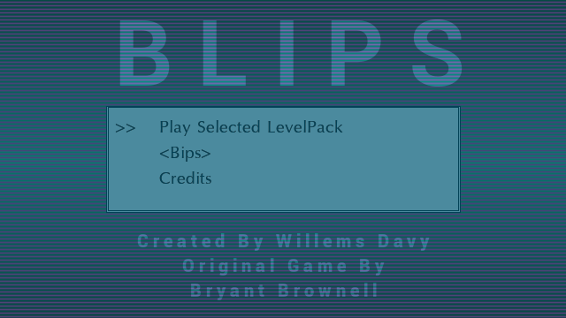
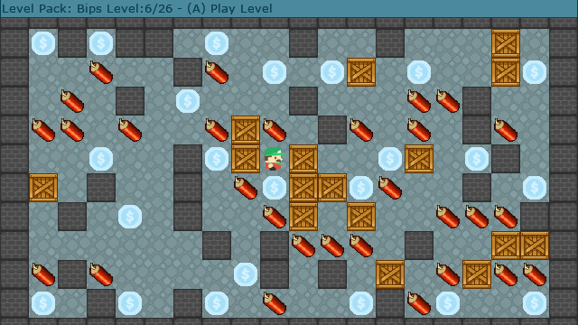

# Blips Vircon32 Version

Blips is a remake of the dos bips game made by Bryant Brownell, its a sokoban style puzzle game but with exploding dynamite and collecting coins

## Screenshots

## Vircon32 Game Features:
- 26 Levels of original Bips game
- Autosaves progress

## Playing the Game:
The aim of the game is to collect all the dollar coins in a level, you need to create pathways to these coins by pushing boxes around or even make them explode by pushing them into the dynamite

## Controls

| Button | Action |
| ------ | ------ |
| Dpad | Select menu's, levels to play in level selector, Move Player during game play|
| A or START | Confirm in menus, level selector and questions asked |
| B | Back in menu, level selector and game |
| X | Cancel on questions asked, during gameplay restart the currently playing level |
| Y | Hold during gameplay and press any direction on the dpad to pan around levels that do not fit the screen |
| R | In level selector increase levels by 5 |
| L | In level selector decrease levels by 5 |

## Credits
Game is a remake of dos bips game made by Bryant Brownell and based on the gp2x version i initially made

### Level authors
- Bryant Brownell
- Landon Brownell
- Caryn Brownell
- The PocoMan Team

### Music
Music was made by donskeeto

### Graphics
- dollar coin - [kenney game assets all in 1](https://kenney.itch.io/kenney-game-assets) - [CC0 1.0 Universal](https://creativecommons.org/publicdomain/zero/1.0/)
- wall: [1001.com](https://opengameart.org/content/sokoban-pack) - [Attribution-ShareAlike 3.0 Unported](https://creativecommons.org/licenses/by-sa/3.0/)
- floor: [Kenney Sokoban tiles](https://opengameart.org/content/sokoban-100-tiles) - [CC0 1.0 Universal](https://creativecommons.org/publicdomain/zero/1.0/)
- player: [Kenney Sokoban tiles](https://opengameart.org/content/sokoban-100-tiles) - [CC0 1.0 Universal](https://creativecommons.org/publicdomain/zero/1.0/)
- box: [SpriteAttack boxes and crates](https://opengameart.org/content/boxes-and-crates-svg-and-pngs) - [CC0 1.0 Universal](https://creativecommons.org/publicdomain/zero/1.0/)
- dynamite: [GUI Icons by Rexard](https://www.gamedevmarket.net/asset/gui-icons-8656) - I Payed for this asset do not reuse !

### Sound
- stageend.wav: [game music stingers and ui sfx pack 2](https://www.gamedevmarket.net/asset/game-music-stingers-and-ui-sfx-pack-2/) - I Payed for this Asset do not reuse !

