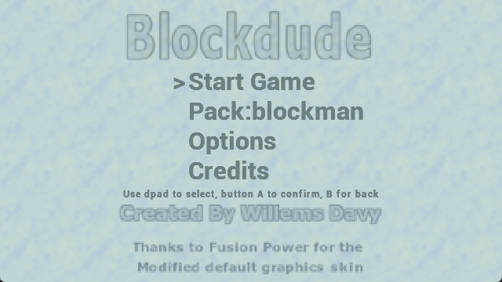
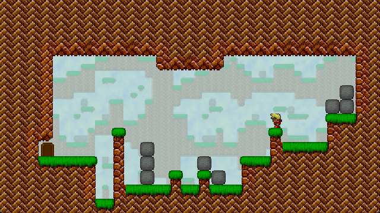
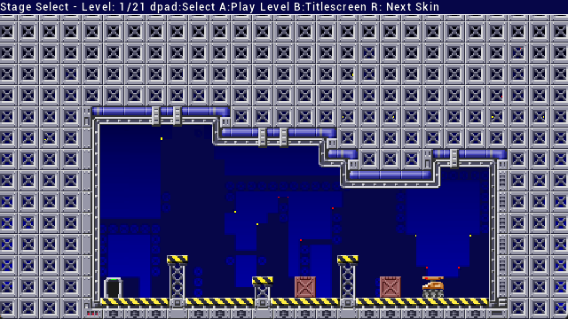
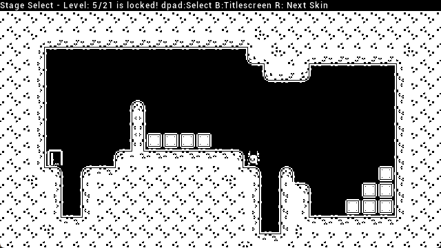
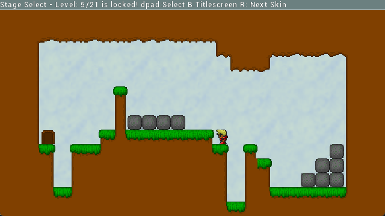
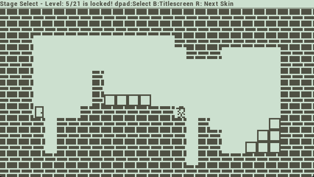

# Blockdude Vircon32 Version
Blockdude is a remake of the well known TI Caluculator game from Brandon Sterner as well as the blockman game from Soleau Software. 
This version of the game for the vircon32 fantasy console is based on the Playdate port which was in itself a port of the GP2X port of blockdude i made over a decade ago.

## Screenshots

## Vircon32 Game Features:
- Adapted code to work with Vircon32
- Adapted graphics to work with Vircon32
- Larger view of the levels
- 21 levels from original blockman game by Soleau Software + 4 levels made by me
- 5 skins to choose from
- Autosaves progress

## Playing the Game:
The aim of the game, in any level, is to move the player to the exit door. You will need to create a path to this exit door by picking up blocks and placing them on strategic locations so you can reach the exit door.
The player will automatically jump on higher level blocks or ground if you keep moving left or right in front of them. 
If the level is bigger than what the vircon32 screen can display there will be a "freeview option" when pressing the menu button on the vircon32 and choosing this menu option will allow you to pan around the level using the dpad.

## Memory card and progress saving
Make sure the memory card you created for the game is inserted before you launch the game. For the retroarch core of the vircon32 this does not seem to be an issue however for the 
original emulator for vircon32 this is an issue as it generally loads a game without automatically attaching the memorycard. So just attach the memory card and reset the game.
Not Resetting the emulator or not inserting a memory card at all may result in loss of progress!

## Controls 

| Button | Action |
| ------ | ------ |
| Dpad | Select menu's, options or levels to play. During gameplay move the player left or right. |
| A | Confirm in menu and level selector, pickup or drop a block in game mode |
| B | Back in menu, level selector and game |
| X | Enable Freeview mode during the game mode |
| Y | Restart current level during the game mode |
| R | Select Next Skin, can be done anywhere |

## Credits
The Blockdude game idea was created by Soleau Software for the dos blockman game and Brandon Sterner for the Ti Calculator based game. I don't know who invented the idea first.

The Game uses 21 levels from the Soleau Software blockman dos game. At The time i had created the gp2x version i had gotten approval to use these levels

The game uses some assets from assets packs i had bought, which you can not reuse without acquiring a valid license for them:
- stage end Sound: game music stingers and ui sfx pack 2 https://www.gamedevmarket.net/asset/game-music-stingers-and-ui-sfx-pack-2/
- pickup & drop sound: medieval fantasy sfx pack: https://www.gamedevmarket.net/asset/medieval-fantasy-sfx-pack-1061/
- walk & jump & fall down: Gamemaster Audio - Pro Sound Collection v1.3 - 16bit: https://www.gamedevmarket.net/asset/pro-sound-collection/

The music was created by Don Skeeto for the gp2x version and is reused in this version of the game.

The game has 5 skins using tilesets created by different people / games
- Default Skin: Based on a Remake of the flatskin made for the gp2x version by Fusion Power
- Tech Skin: Based on a skin made for the gp2x version by fusion power
- Ti Skin: Based on the assets from the Ti calculator game by brandon Sterner 
- Kenney skin: Based on the 1 bit platformer pack https://kenney-assets.itch.io/1-bit-platformer-pack - https://www.kenney.nl
- Flat Skin: Based on the flash game created by Klas Kroon and Kris Katiesen, i had gotten permission at the time of creating the gp2x version to use these assets
