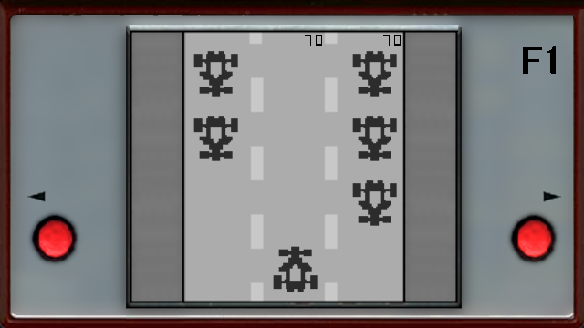
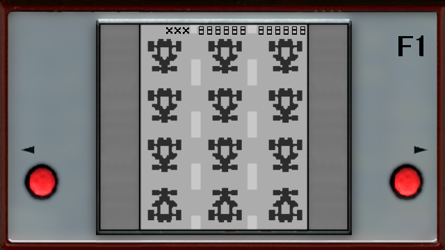

# Formula 1 Vircon32 Version
Formula 1 is a small, fictive formula 1 game & watch style lcd game with high score keeping. 
The Game was initially created over a decade ago for a small retrogame competition in delphi, after which it got ported to the gp2x in c/c++ then to Playdate and now to Vircon32. 
This version is based on the Playdate version but which has added high score saving compared to the original gp2x version.

## Screenshots

## Vircon32 Game Features:
- Code adapted to work with Vircon32 console
- Saves best score in memory card (if inserted)
- Changed sounds so they are traceable and use open licenses
- Adapted graphics to match Vircon32 resolution
- Removed game & watch logo on the handheld image

## Playing the Game
The aim of the game, is to avoid hitting other traffic coming down the screen, you do this by moving your car on the bottom left or right. 

## Controls
Dpad Move Player car left or right

A or B Start a new game at the boot or gameover screen and lets you skip the intro.

## Credits

### Graphics
All graphics are created by me, joyrider3774 aka Willems Davy initially in Jasc Paint Shop Pro 7 for the gp2x version later modified using GIMP.
The "handheld" is a graphically edited image of a picture taken of an LCD Handheld but i can't remember which one. It highly differs from its original.
Feel free to use the graphics as long as you credit me.

### Sound
The game uses sound effects from MADrigal Simualtors, Permission was asked to use the files as well as if it was ok to resample them from 22050hz to 44100hz.
All these sounds use the "[Creative Common Attribution-NonCommercial-NoDerivatives](https://creativecommons.org/licenses/by-nc-nd/4.0/legalcode)" 4.0 license and are created by Luca "MADrigal" Antignano.
His website for the simulators can be found on the following url: http://www.madrigaldesign.it/sim/

Files used:

* gameover.wav - Gameover.wav from Roller Coaster game from MADrigal CD Collection
* crash.wav - Missdock.wav from Galaxy II game from MADrigal CD Collection
* tick.wav - Startbtn.wav from Galaxy II game from MADrigal CD Collection
* start.wav - Start.wav from Galaxy II game from MADrigal CD Collection 
