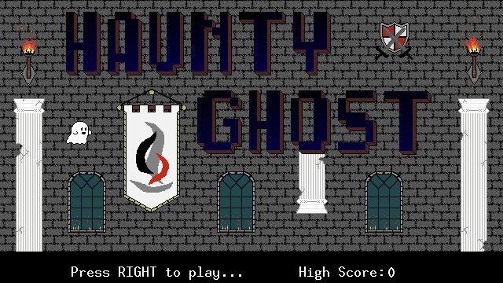
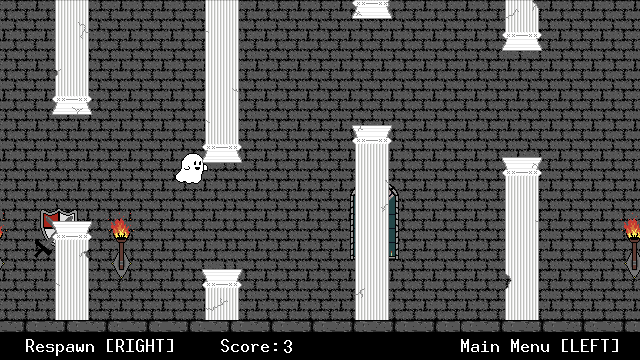

# Haunty Ghost
    
    HAUNTY GHOST   - By Dawson Morey
    
    A project for CSCS2650 Computer Organization
    ... as taught by Matthew Haas (haas@corning-cc.edu)
    ... at SUNY Corning Community College for the Computer
    Science program during the spring2024 semester.

## Screenshots

## Note from the instructor

This game was  the end-of-semester project for  the Computer Organization
course, where we focused on  Vircon32 assembly language, and studying the
low-level nature of a machine.

In both  these and  earlier Computer  Science courses,  specific projects
were given where each student  obtained, configured, and built the latest
release of the Vircon32 Emulator and  DevTools from source (vs just using
the available  release binaries). This  way students also got  some added
exposure interacting with code and build processes they did not create.

HAUNTY GHOST is  a beautiful example of a student  embracing the concepts
being learned in class while dabbling on their own in pursuit of some end
result.

Our college logo is displayed on a banner  flag in the game- as part of a
Student Expo, there  was a "spirit" award, so various  games were dressed
up accordingly in an attempt to garner the award.

## Vircon32 DevTools version

Due  to the  use of  `%define` statements,  Vircon32 DevTools  v24.2.4 or
later is required to build the cartridge.

## How to play

Haunty Ghost is a  spooky take on the "Flappy Bird"  genre of game, where
the object  is to pass  through openings  in obstacles, and  avoid making
contact with any of them. How far can you make it?

Press LEFT to return to the menu.
Press RIGHT to start a game.
Press UP to give a lift to the ghost.
