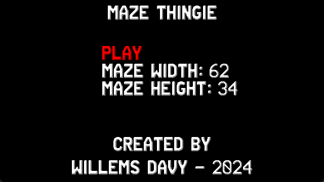
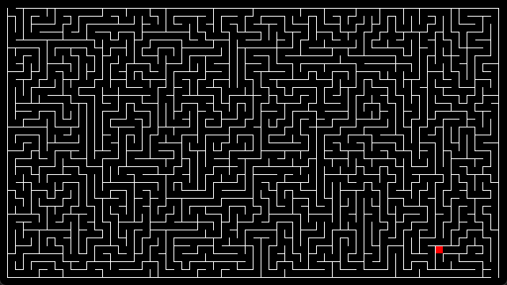

# Mazethingie Vircon32
   

  

This is the Vircon32 fantasy console version of my Mazethingie game which is a maze generator / game. I Initially developped this for learning how to generate mazes for the levels in Waternet. 

## Controls

| Key        | Action                                           |
|------------|--------------------------------------------------|
| Up/Down    | Select menu, move player                         |
| Left/Right | Select mazewidth / height, move player           |
| A, Start   | Confirm in menu, generate new maze while playing |
| B          | Back to titlescreen                              |
| (Hold) X + Direction | Increase, Decrease Mazewidth & height while playing |
## Aim of the game
You are the little red box, always starting in the lower right corner of the maze and you need to try and reach the top left exit of the mazes you generated.
