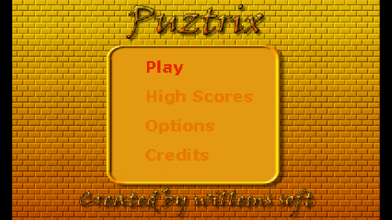
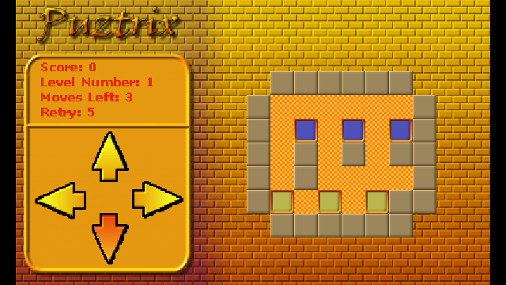
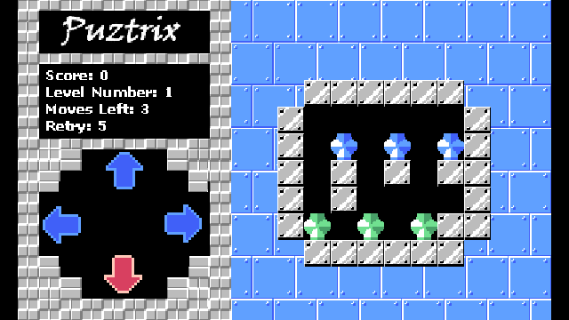

# Puztrix Vircon32 Version
Puztrix is a remake of the Gravnic game from inside the NES Puzznic game.

## Screenshots

## Vircon32 Game Features:
- 80 levels of the original game
- 2 skins
- High score saving and submitting for the original levels
- ability to turn music & sound on/off

## Playing the Game:
In each level there are a number of blocks that needs to be removed from the board. You can do this by moving all blocks in one of the four directions, any same kind of block touching each other will be removed.
The level is done when all of the blocks are removed. Each level also has a predefined maximum number of amount of moves you can make and you get 5 retries to complete all levels. Once all retries have been used it is Game Over and you'll have to start a new game. 

## Controls

| Button | Action |
| ------ | ------ |
| Dpad | Select menu's and options. Choose a direction for all blocks to move in game mode |
| A | Confirm in menu's, give up level in game |
| B | Back in menus and game (to title screen) |
| R | Switch to next skin without going through options |

## Credits
- Puztrix for Vircon32 is created by Willems Davy.
- 80 original "levels" from Gravnic in Puzznic Nes Game.
- Graphics made using Gimp
- Sounds made using SFXR.
- Music was created by radiance of iris - 1996, Taken from the modarchive.
