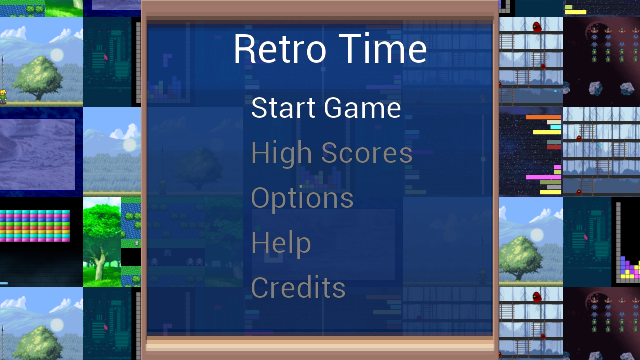
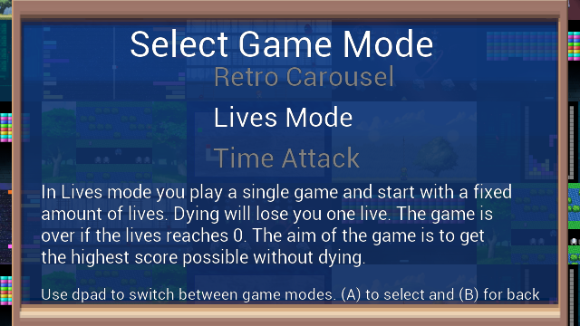
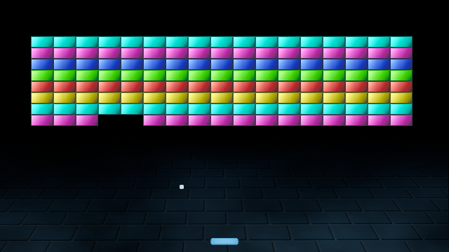
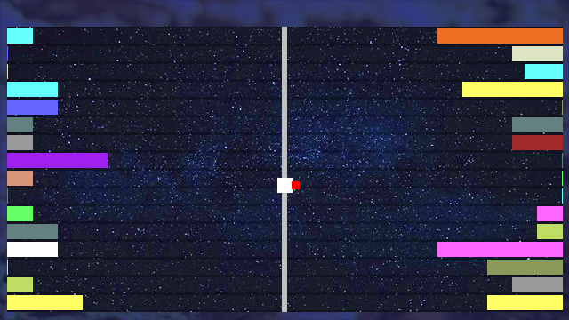

# RetroTime

RetroTime for vircon32 is a game containing 8 retro based games playable in 3 game modes being Retro Carousel, Time Attack and Lives mode. The game is a port from the Playdate version which was a port from the SDL2 version from my competition entry for Fuze 4 for Nintendo switch, in collaboration with Wireframe magazine. 

## Game Modes

The games can be played in 3 game modes

### Retro Carousel Mode
In Retro Carousel mode you will play all games for 2 minutes after each other. You can not die by losing lives. Points will be deducted from the score when dying. The aim is to get the highest score, accumulated over all the games.

### Lives Mode 
In Lives mode you play a single game and start with a fixed amount of lives. Dying will lose you one live. The game is over if the lives reaches 0. The aim of the game is to get the highest score possible without dying.

###  Time Attack
In Time Attack mode you play a single game for 5 minutes. You can not die by losing lives. Points will be deducted from the score when dying. The aim is to get the highest score during these 5 minutes of playing.
 
 
## Games
There are 8 retro based games implemented in this game

### Invaders

Invaders is a game based on Space Invaders (Arcade). Rows of enemies are closing in you. You have to shoot them down before they reach your mining asteroids. Shooting down enemies gains points, shooting down all enemies gains extra points. You can move with dpad of left joystick and shoot with (A). If enemies reach your mining asteroids you will lose a life. Avoid being shot or you will also lose a life. 

### Brick Breaker

Brick Breaker is a game based on Breakout (Arcade). Rows of blocks have to be destroyed by touching them with the ball. You control the  paddle at the bottom of the screen with the dpad. Keeping (A) pressed speeds up the paddle. You have to let the ball bounce of your paddle to send it back in the playfield. Destroying blocks gains points. Fail to bounce back the ball and you lose a life.

### Toady

Toady is a game based on Frogger (Arcade). You control the pet by the dpad and you have to keep moving up. Each time you move up to a place you had not reached yet, you will gain points. Avoid getting hit by traffic, don't fall into water, don't exceed the edges of the playfield or you will lose a life. Collect different fruits to gain extra score.

### Snakey

Snakey is a game based on well snake (Nokia 3310). You control a snake's head (red block) by the dpad. The snake can move in four directions and wants food (green blocks). Each time you eat food the snake's body will grow. Eat food to gain points, the longer your snake is to more points you will gain. Touching the snake's body or going outside the playfield will lose you a life.

### Bubble Buster

Bubble Buster is a game based on Pang (Arcade). You control a player that needs to pop bubbles. You can control the player using the dpad and shoot at bubbles using (A) button. If you hit a bubble it will split up into smaller bubbles and you gain points. Get hit by a bubble and you will lose a life, making you temporary invincible but you can not shoot during this time. Clearing all bubbles gives you extra points.

### Block Stacker

Block Stacker is a game of tetris. You control the blocks with the dpad. You need to stack them in such a manner that they form complete rows. Once this is done that row will be removed. Speed increases gradually and having no place at the top to place a block will lose you a life. You can rotate blocks using (A) and drop them fast using (X).

### Color Invasion

Color Invasion is a game based on Ram-It (Atari 2600). You control the cannon with the dpad. You need to shoot the invading colored bars completely of the screen using (A). Points are awarded when the color bar is completely of the screen, the closer a bar had gotten to the cannon the more points you will gain. You also gain extra points for clearing all bars from the screen. When a colored bar reaches the cannon rail you will lose a life.

### Faster Dave

Faster Dave is a game based on Fast Eddie (Atari 2600). You control Dave with the dpad. You need to avoid or jump over enemies with the (A) button while collecting the magic balls. When you collect 9 balls the end level key is reachable. You are safe on ladders. Points are received for collecting magic balls and getting the end level key. Collecting the 10th magic ball is not required. When you touch an enemy you will a lose life. Every 5 levels, level layout changes.

## Controls

| Button | Action |
| ------ | ------ |
| D-Pad | Directional movement of the player, making selections in the menu's |
| A button | Confirming in menus, the main game action |
| X button | Secondary game action (only used in block stacker to drop a block fast) |
| B | Back in menus, Pause Menu ingame |

## Credits
The game makes uses of multiple payed and free assets packs, below are the credits for them per game.
> **Warning**
> The Project's code is MIT but the assets are not, they all use different licenses, some are free some are Creative Commons and some i even payed for and can only be used with my project. so you can not re-use those as you wish. 

### Main Game User interface

| Asset | Asset Pack | License |
| ----- | --------- | -------- |
| Music.wav | Created and Owned by me on [Strofe](https://www.strofe.com/) |
| back.wav | [ Game Music Stingers And UI SFX Pack 2 by wowsounds](https://www.gamedevmarket.net/asset/game-music-stingers-and-ui-sfx-pack-2/) | [Gamedev market pro-licence](https://static.gamedevmarket.net/terms-conditions/#pro-licence) |
| confirm.wav | [ Game Music Stingers And UI SFX Pack 2 by wowsounds](https://www.gamedevmarket.net/asset/game-music-stingers-and-ui-sfx-pack-2/) | [Gamedev market pro-licence](https://static.gamedevmarket.net/terms-conditions/#pro-licence) |
| select.wav | [ Game Music Stingers And UI SFX Pack 2 by wowsounds](https://www.gamedevmarket.net/asset/game-music-stingers-and-ui-sfx-pack-2/) | [Gamedev market pro-licence](https://static.gamedevmarket.net/terms-conditions/#pro-licence) |
| score.wav | [8-bit Action Music & SFX by Joel Steudler](https://joelsteudler.itch.io/8-bit-action-music-sfx) | [HUMBLE SOFTWARE BUNDLE: FRESH START GAME DEV ASSETS BUNDLE License - if you own the bundle](https://cdn.humblebundle.com/misc/files/hashed/97e53bc6fa248bd5eff48b074b09f21649401cbb.pdf) |
| medal.png | [Kenney medals](https://www.kenney.nl/assets/medals) | [Creative Commons CC0](https://creativecommons.org/share-your-work/public-domain/cc0/) |
| frame.png | [Hazy Hills Battle Background ansimuz](https://ansimuz.itch.io/hazy-hills-battle-background) | [Creative Commons Attribution v4.0 International](https://creativecommons.org/licenses/by/4.0/ ) |

### Shared between games

| Asset | Asset Pack | License |
| ----- | --------- | -------- |
| die.wav | [8-bit Action Music & SFX by Joel Steudler](https://joelsteudler.itch.io/8-bit-action-music-sfx) | [HUMBLE SOFTWARE BUNDLE: FRESH START GAME DEV ASSETS BUNDLE License - if you own the bundle](https://cdn.humblebundle.com/misc/files/hashed/97e53bc6fa248bd5eff48b074b09f21649401cbb.pdf) |
| coin.wav | [8-bit Action Music & SFX by Joel Steudler](https://joelsteudler.itch.io/8-bit-action-music-sfx) | [HUMBLE SOFTWARE BUNDLE: FRESH START GAME DEV ASSETS BUNDLE License - if you own the bundle](https://cdn.humblebundle.com/misc/files/hashed/97e53bc6fa248bd5eff48b074b09f21649401cbb.pdf) |
| succes.wav | [8-bit Action Music & SFX by Joel Steudler](https://joelsteudler.itch.io/8-bit-action-music-sfx) | [HUMBLE SOFTWARE BUNDLE: FRESH START GAME DEV ASSETS BUNDLE License - if you own the bundle](https://cdn.humblebundle.com/misc/files/hashed/97e53bc6fa248bd5eff48b074b09f21649401cbb.pdf) |
| one.wav | My own recorded voice with a robot filter | [Creative Commons Attribution v4.0 International](https://creativecommons.org/licenses/by/4.0/) |
| oneminute.wav |  My own recorded voice with a robot filter | [Creative Commons Attribution v4.0 International](https://creativecommons.org/licenses/by/4.0/) |
| readygo.wav |  My own recorded voice with a robot filter | [Creative Commons Attribution v4.0 International](https://creativecommons.org/licenses/by/4.0/) |
| three.wav |  My own recorded voice with a robot filter | [Creative Commons Attribution v4.0 International](https://creativecommons.org/licenses/by/4.0/) |
| timeover.wav |  My own recorded voice with a robot filter | [Creative Commons Attribution v4.0 International](https://creativecommons.org/licenses/by/4.0/) |
| two.wav |  My own recorded voice with a robot filter | [Creative Commons Attribution v4.0 International](https://creativecommons.org/licenses/by/4.0/) |

### Block Stacker

| Asset | Asset Pack | License |
| ----- | --------- | -------- |
| Music.wav | Created and Owned by me on [Strofe](https://www.strofe.com/) |
| rotate.wav | [Game Music Stingers And UI SFX Pack 2 by wowsounds](https://www.gamedevmarket.net/asset/game-music-stingers-and-ui-sfx-pack-2/) | [Gamedev market pro-licence](https://static.gamedevmarket.net/terms-conditions/#pro-licence) |
| drop.wav | [Pro Sound Collection by gamemasteraudio](https://www.gamedevmarket.net/asset/pro-sound-collection/) | [Gamedev market pro-licence](https://static.gamedevmarket.net/terms-conditions/#pro-licence) |
| lineclear.wav | [8-bit Action Music & SFX by Joel Steudler](https://joelsteudler.itch.io/8-bit-action-music-sfx) | [HUMBLE SOFTWARE BUNDLE: FRESH START GAME DEV ASSETS BUNDLE License - if you own the bundle](https://cdn.humblebundle.com/misc/files/hashed/97e53bc6fa248bd5eff48b074b09f21649401cbb.pdf) |
| background.png | [Cyberpunk Street Environment by ansimuz](https://ansimuz.itch.io/cyberpunk-street-environment) | [CC0 1.0 Universal (CC0 1.0)](https://creativecommons.org/publicdomain/zero/1.0/)

### Brick Breaker

| Asset | Asset Pack | License |
| ----- | --------- | -------- |
| Music.wav | Created and Owned by me on [Strofe](https://www.strofe.com/) |
| bat.wav | [Pro Sound Collection by gamemasteraudio](https://www.gamedevmarket.net/asset/pro-sound-collection/) | [Gamedev market pro-licence](https://static.gamedevmarket.net/terms-conditions/#pro-licence) |
| brick.wav | [VS-01-Cowbell004.wav from Gijs De Mik](https://stardust-audio.com/Down/GijsPerc2017.zip) |  [Free to use](https://stardust-audio.com/) |
| ball.png | [Basic breakout asset pack created by me (joyrider3774)](https://joyrider3774.itch.io/basic-breakout-asset-pack) | [Attribution 4.0 International (CC BY 4.0)](https://creativecommons.org/licenses/by/4.0/?ref=chooser-v1) |
| blocks.png | [Basic breakout asset pack created by me (joyrider3774)](https://joyrider3774.itch.io/basic-breakout-asset-pack) | [Attribution 4.0 International (CC BY 4.0)](https://creativecommons.org/licenses/by/4.0/?ref=chooser-v1) |
| paddle.png | [Basic breakout asset pack created by me (joyrider3774)](https://joyrider3774.itch.io/basic-breakout-asset-pack) | [Attribution 4.0 International (CC BY 4.0)](https://creativecommons.org/licenses/by/4.0/?ref=chooser-v1) |

### Faster Dave

| Asset | Asset Pack | License |
| ----- | --------- | -------- |
| Music.wav | Created and Owned by me on [Strofe](https://www.strofe.com/) |
| Jump.wav | [VS-01-Cowbell004.wav from Gijs De Mik](https://stardust-audio.com/Down/GijsPerc2017.zip) |  [Free to use](https://stardust-audio.com/) |
| background.png | [Pixel Art Snowy Forest by edermunizz](https://www.gamedevmarket.net/asset/pixel-art-snowy-forest-7308/) | [Gamedev market pro-licence](https://static.gamedevmarket.net/terms-conditions/#pro-licence) |
| ladder.png | [Pixel Art Snowy Forest by edermunizz](https://www.gamedevmarket.net/asset/pixel-art-snowy-forest-7308/) | [Gamedev market pro-licence](https://static.gamedevmarket.net/terms-conditions/#pro-licence) |
| floortileset.png | [Pixel Art Snowy Forest by edermunizz](https://www.gamedevmarket.net/asset/pixel-art-snowy-forest-7308/) | [Gamedev market pro-licence](https://static.gamedevmarket.net/terms-conditions/#pro-licence) |
| key.png | [2D Painterly Tiles by Ravenmore](https://www.gamedevmarket.net/asset/painterly-platformer-pack-1126/) | [Gamedev market pro-licence](https://static.gamedevmarket.net/terms-conditions/#pro-licence) |
| Character_character_climb.png | [2D Painterly Tiles by Ravenmore](https://www.gamedevmarket.net/asset/painterly-platformer-pack-1126/) | [Gamedev market pro-licence]( https://static.gamedevmarket.net/terms-conditions/#pro-licence) |
| Character_character_idle.png | [2D Painterly Tiles by Ravenmore](https://www.gamedevmarket.net/asset/painterly-platformer-pack-1126/) | [Gamedev market pro-licence](https://static.gamedevmarket.net/terms-conditions/#pro-licence) |
| Character_character_jump_up.png | [2D Painterly Tiles by Ravenmore](https://www.gamedevmarket.net/asset/painterly-platformer-pack-1126/) | [Gamedev market pro-licence](https://static.gamedevmarket.net/terms-conditions/#pro-licence) |
| Character_character_run.png | [2D Painterly Tiles by Ravenmore](https://www.gamedevmarket.net/asset/painterly-platformer-pack-1126/) | [Gamedev market pro-licence](https://static.gamedevmarket.net/terms-conditions/#pro-licence) |
| enemy.png | [ PIPOYA FREE RPG Character Sprites 32x32 by Pipoya (Enemy 15-3.png)](https://pipoya.itch.io/pipoya-free-rpg-character-sprites-32x32) |  [free For commercial or personal use](https://pipoya.itch.io/pipoya-free-rpg-character-sprites-32x32) |

### Bubble Buster

| Asset | Asset Pack | License |
| ----- | --------- | -------- |
| Music.wav | Created and Owned by me on [Strofe](https://www.strofe.com/) |
| shoot.wav | [Medieval Fantasy SFX Pack by evil mind entertainment](https://www.gamedevmarket.net/asset/medieval-fantasy-sfx-pack-1061/) | [Gamedev market pro-licence](https://static.gamedevmarket.net/terms-conditions/#pro-licence) |
| ball.png | Created and Owned by me | [Creative Commons Attribution v4.0 International](https://creativecommons.org/licenses/by/4.0/ ) |
| character.png | [Master of the Wind Character Sprites by finalbossblues](http://finalbossblues.com/timefantasy/freebies/master-of-the-wind-character-sprites/) | [No Commercial use, assets are based on another games assets for which approvement to redistribute these was gotten](http://finalbossblues.com/timefantasy/freebies/master-of-the-wind-character-sprites/) |
| background.png | [country side platfformer by ansimuz](https://ansimuz.itch.io/country-side-platfformer) | [CC0 1.0 Universal (CC0 1.0)](https://creativecommons.org/publicdomain/zero/1.0/) |
| weapon.png | [effect parts by pipoya](https://pipoya.net/sozai/assets/effects/effect-parts/) | [free to use](https://pipoya.net/sozai/assets/effects/effect-parts/) |

### Color Invasion

| Asset | Asset Pack | License |
| ----- | --------- | -------- |
| Music.wav | Created and Owned by me on [Strofe](https://www.strofe.com/) |
| hit.wav | [Game Music Stingers And UI SFX Pack 2 by wowsounds](https://www.gamedevmarket.net/asset/game-music-stingers-and-ui-sfx-pack-2/) | [Gamedev market pro-licence](https://static.gamedevmarket.net/terms-conditions/#pro-licence) |
| shoot.wav | [Pro Sound Collection by gamemasteraudio](https://www.gamedevmarket.net/asset/pro-sound-collection/) | [Gamedev market pro-licence](https://static.gamedevmarket.net/terms-conditions/#pro-licence) |
| background.png | [Created by Vircon32 author using "cluster of stars" photo by Kai Pilger](https://www.pexels.com/photo/cluster-of-stars-1341279/) | [Pexels license - free to use](https://www.pexels.com/license/) |

### Snakey

| Asset | Asset Pack | License |
| ----- | --------- | -------- |
| Music.wav | Created and Owned by me on [Strofe](https://www.strofe.com/) |
| food.wav | [Pro Sound Collection by gamemasteraudio](https://www.gamedevmarket.net/asset/pro-sound-collection/) | [Gamedev market pro-licence](https://static.gamedevmarket.net/terms-conditions/#pro-licence) |
| background.png | [Created by Vircon32 author using "rattlesnake on ground" photo by Uriel Venegas](https://www.pexels.com/photo/rattlesnake-on-ground-18029251/) | [Pexels license - free to use] |

### Invaders

| Asset | Asset Pack | License |
| ----- | --------- | -------- |
| Music.wav | Created and Owned by me on [Strofe](https://www.strofe.com/) |
| enemydeath.wav | [Game Music Stingers And UI SFX Pack 2 by wowsound](https://www.gamedevmarket.net/asset/game-music-stingers-and-ui-sfx-pack-2/) | [Gamedev market pro-licence](https://static.gamedevmarket.net/terms-conditions/#pro-licence) |
| playerdeath.wav | [Game Music Stingers And UI SFX Pack 2 by wowsound](https://www.gamedevmarket.net/asset/game-music-stingers-and-ui-sfx-pack-2/) | [Gamedev market pro-licence](https://static.gamedevmarket.net/terms-conditions/#pro-licence) |
| enemyshoot.wav | [retro_laser_gun_shoot_37 modified tempo from Pro Sound Collection by gamemasteraudio](https://www.gamedevmarket.net/asset/pro-sound-collection/) | [Gamedev market pro-licence](https://static.gamedevmarket.net/terms-conditions/#pro-licence) |
| playershoot.wav | [retro_laser_gun_shoot_37 modified tempo from Pro Sound Collection by gamemasteraudio](https://www.gamedevmarket.net/asset/pro-sound-collection/) | [Gamedev market pro-licence](https://static.gamedevmarket.net/terms-conditions/#pro-licence) |
| background.png | [Patreon's Top Down Collection by ansimuz](https://ansimuz.itch.io/patreons-top-down-collection) | [free in your personal or commercial projects](https://ansimuz.itch.io/patreons-top-down-collection) |
| background.png | [Space Background by ansimuz ](https://ansimuz.itch.io/space-background) | [free in your personal or commercial projects](https://ansimuz.itch.io/space-background) |
| bullet.png | [Patreon's Top Down Collection by ansimuz](https://ansimuz.itch.io/patreons-top-down-collection) | [free in your personal or commercial projects](https://ansimuz.itch.io/patreons-top-down-collection) |
| enemy1.png | [Patreon's Top Down Collection by ansimuz](https://ansimuz.itch.io/patreons-top-down-collection) | [free in your personal or commercial projects](https://ansimuz.itch.io/patreons-top-down-collection) |
| enemy2.png | [Patreon's Top Down Collection by ansimuz](https://ansimuz.itch.io/patreons-top-down-collection) | [free in your personal or commercial projects](https://ansimuz.itch.io/patreons-top-down-collection) |
| enemy3.png | [Patreon's Top Down Collection by ansimuz](https://ansimuz.itch.io/patreons-top-down-collection) | [free in your personal or commercial projects](https://ansimuz.itch.io/patreons-top-down-collection) |
| explosion.png | [Patreon's Top Down Collection by ansimuz](https://ansimuz.itch.io/patreons-top-down-collection) | [free in your personal or commercial projects](https://ansimuz.itch.io/patreons-top-down-collection) |
| player.png | [Patreon's Top Down Collection by ansimuz](https://ansimuz.itch.io/patreons-top-down-collection) | [free in your personal or commercial projects](https://ansimuz.itch.io/patreons-top-down-collection) |
| background.png | [Space Background by ansimuz ](https://ansimuz.itch.io/space-background) | [free in your personal or commercial projects](https://ansimuz.itch.io/space-background) |

### Toady

| Asset | Asset Pack | License |
| ----- | --------- | -------- |
| Music.wav | Created and Owned by me on [Strofe](https://www.strofe.com/) |
| move.wav | [game music stingers and ui sfx pack 2](https://www.gamedevmarket.net/asset/game-music-stingers-and-ui-sfx-pack-2/) | [Gamedev market pro-licence](https://static.gamedevmarket.net/terms-conditions/#pro-licence) |
| food.wav | [Pro Sound Collection by gamemasteraudio](https://www.gamedevmarket.net/asset/pro-sound-collection/) | [Gamedev market pro-licence]( https://static.gamedevmarket.net/terms-conditions/#pro-licence) |
| background | [Bonus pictures by pipoya](https://pipoya.net/sozai/assets/background/background-image/) | [free to use](https://pipoya.net/sozai/assets/background/background-image/) | 
| carblue.png | [isometric vehicles by kenny](https://kenney.nl/assets/isometric-vehicles-1) | [Creative Commons CC0]( https://creativecommons.org/share-your-work/public-domain/cc0/) |
| police.png | [isometric vehicles by kenny](https://kenney.nl/assets/isometric-vehicles-1) | [Creative Commons CC0]( https://creativecommons.org/share-your-work/public-domain/cc0/) |
| taxi.png | [isometric vehicles by kenny](https://kenney.nl/assets/isometric-vehicles-1) |  [Creative Commons CC0]( https://creativecommons.org/share-your-work/public-domain/cc0/) |
| garbagetruck.png | [isometric vehicls by kenny](https://kenney.nl/assets/isometric-vehicles-1) | [Creative Commons CC0]( https://creativecommons.org/share-your-work/public-domain/cc0/) |
| ambulance.png | [isometric vehicles by kenny](https://kenney.nl/assets/isometric-vehicles-1) | [Creative Commons CC0]( https://creativecommons.org/share-your-work/public-domain/cc0/) |
| player.png | [Tyler Warren RPG Battlers – 7th 50 - Time Fantasy Tribute](https://tylerjwarren.itch.io/7th-50-time-fantasy-tribute) | [HUMBLE SOFTWARE BUNDLE: FRESH START GAME DEV ASSETS BUNDLE License - if you own the bundle](https://cdn.humblebundle.com/misc/files/hashed/97e53bc6fa248bd5eff48b074b09f21649401cbb.pdf) |
| waterplant.png | [Open RPG Fantasy Tilesets by finalbossblue](https://finalbossblues.itch.io/openrtp-tiles) | [CC0 1.0 Universal (CC0 1.0)](https://creativecommons.org/publicdomain/zero/1.0/) |
| apple.png | [Small Fruit Assets 16x16 by dantepixels](https://dantepixels.itch.io/small-fruits-asset-16x16) [@pixelahead](https://twitter.com/Pixelahead)| [free in your personal or commercial projects](https://dantepixels.itch.io/small-fruits-asset-16x16) |
| cherry.png | [Small Fruit Assets 16x16 by dantepixels](https://dantepixels.itch.io/small-fruits-asset-16x16) [@pixelahead](https://twitter.com/Pixelahead)| [free in your personal or commercial projects](https://dantepixels.itch.io/small-fruits-asset-16x16) |
| lemon.png | [Small Fruit Assets 16x16 by dantepixels](https://dantepixels.itch.io/small-fruits-asset-16x16) [@pixelahead](https://twitter.com/Pixelahead)| [free in your personal or commercial projects](https://dantepixels.itch.io/small-fruits-asset-16x16) |
| watergrass.png | Created and Owned by me | [Creative Commons Attribution v4.0 International]( https://creativecommons.org/licenses/by/4.0/ ) |
