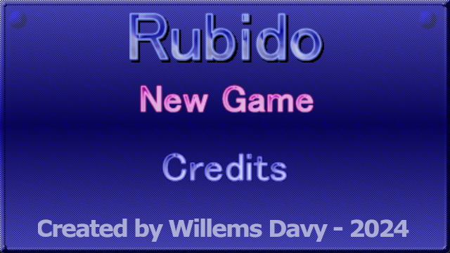
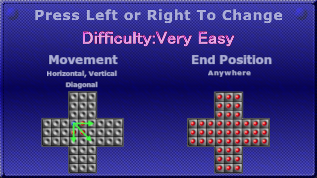
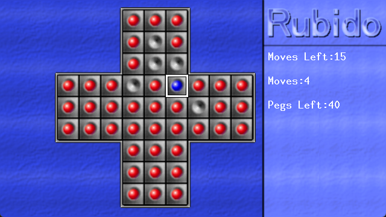

# Rubido Vircon32 Version
Rubido is a little chinese checkers or solitaire game with four difficulties.

## Screenshots

## Vircon32 Game Features:
- Code adapted to work with Vircon32 console
- Four difficulties
- Saves best results in memory card (if inserted)
- Much faster board part retrieving, it no longer searches the internal list but directly accesses it
- Changed sounds so they are traceable or use open licenses

## Playing the Game:
The aim of the game in chinese checkers is to select a (red) peg on the board and jump over another (red) peg to land on an empty spot. When doing this the peg you jumped over will be removed from the board.
You need to play the game in such a way that only one peg remains on the board at the end. Depending on the difficulty you had chosen this can be either (only) in the middle of the board or anywhere on the board.
Also depending on the difficulty you had chosen you can either jump horizontally and vertically over pegs or diagonally as well.

## Diffuclties 

### Very Easy
- Jump over Pegs vertically, horizontally and diagonally
- Last Peg can be anywhere on the board

### Easy
- Jump over Pegs vertically, horizontally and diagonally
- Last Peg must end on the middle board

### Hard
- Jump over Pegs vertically and horizontally only
- Last Peg can be anywhere on the board

### Very Hard
- Jump over Pegs vertically and horizontally only
- Last Peg must end on the middle board

## Controls
| Button | Action |
| ------ | ------ |
| Dpad | Select menu's or difficulties. During gameplay move the peg selector around. |
| A or Start | Confirm in menu and difficulty selector. During gameplay activate the peg where the peg selector is. If there was a peg already selected it will deselect it |
| X | During gameplay deselect the currently selected peg |
| B | Return to Title screen |

## Credits

### Libs
Game makes use of DrawPrimitives library from [@vircon32](https://www.github.com/vircon32) provided under 3-Clause BSD License.

### Graphics 
The Graphics are made by me willems davy aka joyrider3774 using gimp, based on the colored graphics i had created for the gp2x version in jasc paint shop pro 7, more than a decade ago.

### Sound
* winner.wav - Fupi - winfantasia.wav from winjingle.zip from https://opengameart.org/content/win-jingle
* loser.wav - 0new4y - No attribution required - https://opengameart.org/content/game-over-trumpet-sfx
* start.wav - Alexander - Attribution-NonCommercial 4.0 International (CC BY-NC 4.0) - https://orangefreesounds.com/chinese-gong-sound/
* good.wav - Alexander - Attribution-NonCommercial 4.0 International (CC BY-NC 4.0) - https://orangefreesounds.com/glitch-button-short-sound-effect/
* select.wav - created by me using BFXR standalone app (feel free to use) - https://www.bfxr.net/
* wrong.wav - created by me using BFXR standalone app (feel free to use) - https://www.bfxr.net/

### Music
It is unknown who created the music. 
All i know is it originated from a midi file named "chineOPL.mid" which was downloaded somewhere during the 1990's but google yields no results and shazam or soundhound don't recognize it.
If you happen to recognize it please let me know so i can give proper credit
