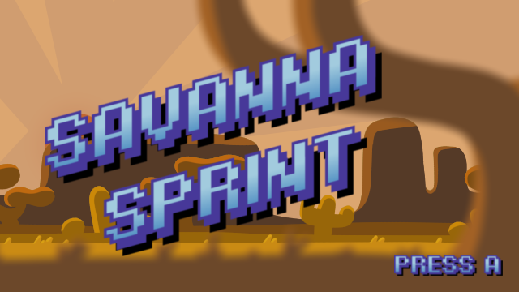
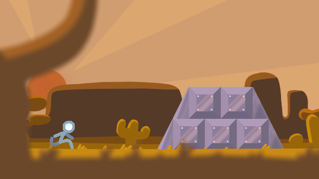

# Savanna Sprint
    
    SAVANNA SPRINT - By William Alley
                     Discord: alleypercent
                     Email: walley@corning-cc.edu
    
    A project for CSCS2320 Data Structures,
                  CSCS2330 Discrete Structures,  and
                  CSCS2650 Computer Organization
    ... as taught by Matthew Haas (haas@corning-cc.edu)
    ... at SUNY Corning Community College for the Computer
    Science program during the fall2023 semester.

## Screenshots

## Note from the instructor

This game was produced out of  the projects and course activities of Data
Structures,  Discrete Structures,  and Computer  Organization, which  the
author  took all  in the  same  semester (typically  Data Structures  and
Discrete are taken  in the Fall semester, while  Computer Organization is
taking te following semester in the spring).

In both  these and  earlier Computer  Science courses,  specific projects
were given where each student  obtained, configured, and built the latest
release of the Vircon32 Emulator and  DevTools from source (vs just using
the available  release binaries). This  way students also got  some added
exposure interacting with code and build processes they did not create.

SAVANNAH  SPRINT  is a  beautiful  example  of  a student  embracing  the
concepts being learned in class while dabbling on their own in pursuit of
some end result. In Data Structures,  the focus was on the implementation
of  linked lists,  stacks,  queues, and  trees.  In Discrete  Structures,
exploring  logic  and  starting  to   pursue  topics  of  efficiency  and
optimization.  In Computer  Organization,  we study  the  true nature  of
the  machine,  ultimately  focusing  on learning  assembly  language  and
using it  to implement various solutions  (often involving memory/pointer
transactions).

If memory serves,  this game was started as a  Vircon32 assembly language
project. It  was what William cut  his teeth on while  learning assembly.
The undertaking was  impressive, although between it  being assembly, and
learning  it,  and  the  time  constraints of  the  semester,  there  are
certainly better ways  of organizing the code. Still nothing  short of an
impressive feat considering it was pulled off in a matter of weeks.

Once the assembly version  was functional, a port was made  to C, as part
of an end of  semester project. This is the C version  of the game, which
improved in some ways from the  original assembly version, which was more
limited or restricted in functionality.

The makerom.sh script was a creation of William's making. Likely based on
the make.sh scripts provided in the HelloWorld tutorial, he implemented a
delightful  level of  functionality  allowing for  easier variability  of
project builds. In some cases, there  could be multiple XML files / build
modes for  a project, and  with this  script, selecting which  variant to
build is  a simple matter  of specifying the  desired XML file.  For this
standalone  release,  largely overkill.  But  shows  off his  proficiency
in  writing  BASH scripts,  as  was  learned  in my  CSCS1730  UNIX/Linux
Fundamentals course.

## How to compile the code

An  accompanying makerom.sh  script has  been provided  for ease  of use.
Simply  run  the following  commands  and  you'll  be given  a  resulting
Vircon32 ROM file (.v32) to play the game.

    > ./makerom SavannaSprint.c SavannahSprint.xml
    > Vircon32 SavannahSprint.v32

## How to play

Savanna  Sprint  is an  "Infinite  Runner."  It  is  a simple  game  only
containing two controls:

Press A (X on Keyboard) to Jump.
Press B (Z on Keyboard) to Slide.

You can  hold A to  increase your jump  height. Although holding  A after
you've reached the apex of your jump does nothing.

Your goal  is to  survive as  long as  possible. Metallic  Obstacles will
appear from the right for you to dodge. Jump and Slide to avoid them.

There are 7 different Obstacle patterns  that can appear, some rarer than
others.  Only  one  obstacle  may  appear  at  one  time.  Here  are  the
probabilities for each pattern:

|# |Obstacle |Chance |
|--|---------|-------|
|1 |Platform | 18.2% |
|2 |Mound    | 18.2% |
|3 |Overhang | 15.2% |
|4 |Stairs   | 15.2% |
|5 |Weave    | 15.2% |
|6 |Pit      | 12.1% |
|7 |Castle   |  6.1% |

## How the game works

There's a lot  of elements to this  game so let's break  it into bitsized
chunks to make explanations easier.

### Part 1 - Game structure

There  are three  different "scenes"  the game  can exist  in: the  Title
screen, Gameplay, and Death screen.  An integer flag controls which scene
gets computed and rendered.

The  Title and  Death screens  are mostly  the same;  a still  image with
blinking text  on it. The program  is loaded into the  title screen. When
the user presses A, Gameplay is loaded. When the player dies, Gameplay is
reset and the Death screen is loaded. Pressing A loads Gameplay again.

### Part 2 - Parallax background

There  are two  sections to  the  background: Background  layers and  the
Foreground layer, each having different code structures.

The Background layers are simple. Each layer has an X-axis position and a
speed. Each frame,  the position value is decremented by  the speed. Once
the X  position is too  far to the left,  it's incremented by  the screen
width to maintain the illusion.

The Foreground is  much more complicated. A struct was  used to store one
section  of Foreground,  with an  X  position and  a type  flag (tree  or
grass).

Three of these  structs were stored in  a Queue, and each  piece is moved
like the Background  layers. However, once one piece goes  too far to the
right, it's  popped from the  Queue, that  piece has its  type randomized
(1/6 chance for a  Tree), and is pushed back into the  queue at the other
side. Imagine it like a conveyer belt.

### Part 3 - Player character

The Player's  data is  also stored  in a  struct. It  contains positional
integers, mathematical integers, and various flags so that actions cannot
overlap each other.

While  some actions,  like sliding  and being  dead, are  simple toggles,
Jumping  is  a  lot more  complex.  In  order  to  have a  realistic  and
satisfying feeling jump, some simple physics needed to be implemented.

The player has vertical position, speed, and acceleration variables. When
a jump  is inputted, the speed  and acceleration are set.  On each frame,
the  player's speed  is decremented  by  the acceleration,  and then  the
position is decremented by the speed. This provides a parabolic motion.

To  have  variable  jump  heights  based  on how  long  A  is  held,  the
acceleration  is swapped  between two  different constants.  The non-held
acceleration is 3x as  great as the held one, so  the player stops rising
faster  when its  not  held.  Once the  player  starts moving  downwards,
acceleration is  set to the lower  of the acceleration constants  so that
gravity feels consistent no matter what.

### Part 4 - Obstacle infrastructure

Obstacle patterns are broken into  each individual building block: Either
a Block or  a Spike element. Each  element is a struct with  a type flag,
and positional coordinates.

These individual element structs are stored within an Array of Lists. The
Array is 7 elements long, one for each pattern that can appear. Each list
in the array contains the data for each pattern.

At runtime, each  list in the array  is populated with the  data for each
pattern, and are placed just off-screen  to the right. An integer flag is
used to trigger when one of the obstacles can move across the screen.

As listed  above, each pattern  has a set chance  to appear. An  Array of
size 33  is used to store  the obstacle IDs.  When an obstacle is  set to
spawn, a number  is randomly generated, modulused by 33,  and that number
is used to pick the correcct obstacle ID out of the probabilities array.

Once an  obstacle has moved  fully off-screen to  the left, it  is placed
back on  the right  side of  the screen  and the  flag that  controls the
obstacles is reset to zero.

Collision  is relatively  simple. Spikes  have two  hitboxes that  reside
inside it (big  enough that the spike is mostly  covered, small enough to
be  computationally efficient).  Blocks have  two hitboxes,  one for  the
player to  walk on, and one  everywhere else which will  kill the player.
The Player's hitbox is smaller than you think so the game feels fairer.

### Part 5 - That which is not working

Sound Effects  in this game  are fairly rough, as  this is my  first time
using the  feature in Vircon32. All  sounds seem to be  delayed by around
half a second, which feels wrong. I  was able to work around this for the
title and death screens, but everywhere else has a noticeable delay.

Only  one  obstacle is  able  to  exist at  a  time.  Maybe there's  some
workaround, but not one I'm able to find in a quick amount of time.

### Part 6 - Miscellaneous

The player jumping physics has some  applied mathematics to them, and the
Obstacle  spawning uses a probabilities  array.

Other than that, I'd say I achieved my goal for  this  game!

Enjoy!

