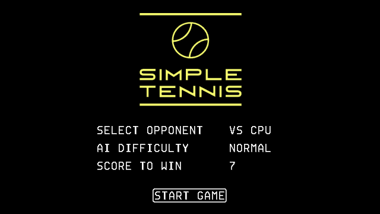
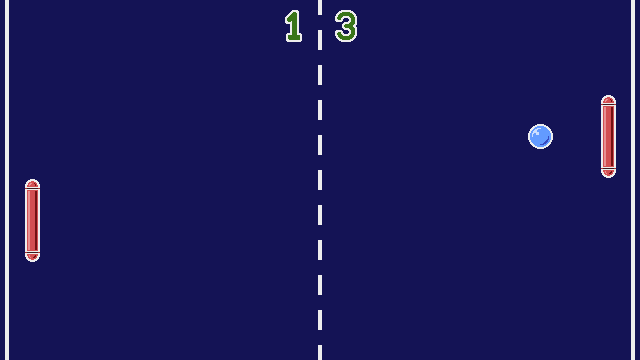

# SimpleTennis
A Vircon32 game made by Jack Brian.
Released on January 2nd, 2022.

This game is your basic Pong clone, but it includes a few options for you to configure it to your liking and add a little depth.

###  Screenshots:

    
    
  
###  Credits:

    The font used for game texts was created by Carra.
    Score numbers were adapted from Carra's games.
    Everything else in this game was created by Jack Brian.

###  License:

    This game is free and open source. It is offered under the 3-Clause
    BSD License, which full text is the following:
    
    Copyright 2022 Jack Brian
    
    Redistribution and use in source and binary forms, with or without
    modification, are permitted provided that the following conditions
    are met:
    
    1. Redistributions of source code must retain the above copyright
    notice, this list of conditions and the following disclaimer.
    
    2. Redistributions in binary form must reproduce the above copyright
    notice, this list of conditions and the following disclaimer in the
    documentation and/or other materials provided with the distribution.
    
    3. Neither the name of the copyright holder nor the names of its
    contributors may be used to endorse or promote products derived from
    this software without specific prior written permission.
    
    THIS SOFTWARE IS PROVIDED BY THE COPYRIGHT HOLDERS AND CONTRIBUTORS
    "AS IS" AND ANY EXPRESS OR IMPLIED WARRANTIES, INCLUDING, BUT NOT
    LIMITED TO, THE IMPLIED WARRANTIES OF MERCHANTABILITY AND FITNESS FOR
    A PARTICULAR PURPOSE ARE DISCLAIMED. IN NO EVENT SHALL THE COPYRIGHT
    HOLDER OR CONTRIBUTORS BE LIABLE FOR ANY DIRECT, INDIRECT, INCIDENTAL,
    SPECIAL, EXEMPLARY, OR CONSEQUENTIAL DAMAGES (INCLUDING, BUT NOT
    LIMITED TO, PROCUREMENT OF SUBSTITUTE GOODS OR SERVICES; LOSS OF USE,
    DATA, OR PROFITS; OR BUSINESS INTERRUPTION) HOWEVER CAUSED AND ON ANY
    THEORY OF LIABILITY, WHETHER IN CONTRACT, STRICT LIABILITY, OR TORT
    (INCLUDING NEGLIGENCE OR OTHERWISE) ARISING IN ANY WAY OUT OF THE USE
    OF THIS SOFTWARE, EVEN IF ADVISED OF THE POSSIBILITY OF SUCH DAMAGE.
