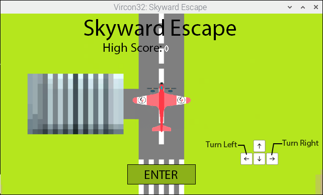
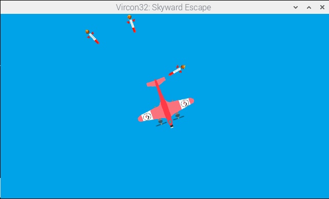

# Skyward Escape
    
    SKYWARD ESCAPE - By Josiah Wieland
                     Discord: JosiahW
                     Email: wielandjosiah@gmail.com

                     Music by: Gavin Suber
    
    A project for CSCS2650 Computer Organization
    ... as taught by Matthew Haas (haas@corning-cc.edu)
    ... at SUNY Corning Community College for the Computer
    Science program during the spring2024 semester.

## Screenshots

## Note from the instructor

This game was  the end-of-semester project for  the Computer Organization
course, where we focused on  Vircon32 assembly language, and studying the
low-level nature of a machine.

In both  these and  earlier Computer  Science courses,  specific projects
were given where each student  obtained, configured, and built the latest
release of the Vircon32 Emulator and  DevTools from source (vs just using
the available  release binaries). This  way students also got  some added
exposure interacting with code and build processes they did not create.

SKYWARD ESCAPE is a beautiful example of a student embracing the concepts
being learned in class while dabbling on their own in pursuit of some end
result.

## Vircon32 DevTools version

Due  to the  use of  `%define` statements,  Vircon32 DevTools  v24.2.4 or
later is required to build the cartridge.

## How to play

Skyward Escape  is a  game where  you fly  a plane  and attempt  to evade
pursuing missiles. It is a simple game:

Press START (by default Enter on a Keyboard) to Begin.
Directional arrows to orient the plane.

