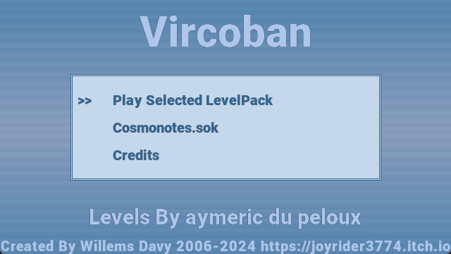
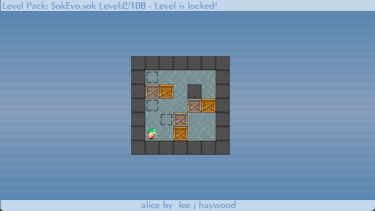
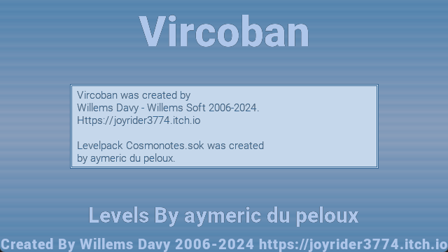
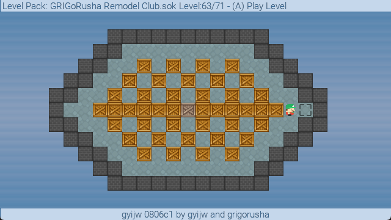

# Vircoban

Vircoban for vircon32 is a remake of the classic Sokoban game. 
You as the player need to push boxes to specific locations in the level. 
Once all boxes are pushed to the correct spots the level is finished. 
Vircoban is basically a sokoban engine, it contains all the game rules and has the ability to use (asci) level packs. 
The game engine also has an undo system up to 1000 moves

This version is a cleanup / port of my old Sokoban gp2x version, using open source assets and adapted code

## Screenshots

## Game Features:
- Multiple Supplied Levels spread over different (default) level packs using asci text level sets
- Max 26x15 level size, will filter ascii sets if levels are too big
- Autosaves progress

## Playing the Game:
Vircoban Will start up at a main menu, here you can choose the level pack you wish to play by using left and right when the level pack name is selected (it's between "<>" signs).
When a level pack is loaded for game play, the level selector will show up. Here you select what level you wish to play, if it has been unlocked yet. By default the selector will show the last unlocked level.
After you solved a level one extra level will be unlocked. you always have to solve to last unlocked level in order to unlock the next one. If you are new to Sokoban, i suggest starting with the SokWhole levels.

## Controls

| Button | Action |
| ------ | ------ |
| DPAD |	move main player, select menus |
| A |	Confirm in menus, level selector and questions asked, Undo moves during gameplay |
| B | Quit to title screen on the level selector, Quit to level selector in game mode. |
| Y | during gameplay restart the level |
| X | Cancel in questions asked |
| START | Show statistics during a game as well as more level details like comments if available |
| L | At the level Selector decrease selected level with 5, During game play select the previous music. |
| R | At the level Selector increase selected level with 5, During game play select the next music. |

## History
V1.1:
- Fix loading levels where player is on a spot for a box and the spot did not get loaded.

V1.0:
- Initial Release

## Credits
Game is an adaptation from the gp2x version i (willems davy, aka joyrider3774) initially made many years ago

### Fonts
- Roboto-Black by google
- Roboto-Light by google

### Graphics
- wall: [1001.com](https://opengameart.org/content/sokoban-pack) - [Attribution-ShareAlike 3.0 Unported](https://creativecommons.org/licenses/by-sa/3.0/)
- floor: [Kenney Sokoban tiles](https://opengameart.org/content/sokoban-100-tiles) - [CC0 1.0 Universal](https://creativecommons.org/publicdomain/zero/1.0/)
- player: [Kenney Sokoban tiles](https://opengameart.org/content/sokoban-100-tiles) - [CC0 1.0 Universal](https://creativecommons.org/publicdomain/zero/1.0/)
- box: [SpriteAttack boxes and crates](https://opengameart.org/content/boxes-and-crates-svg-and-pngs) - [CC0 1.0 Universal](https://creativecommons.org/publicdomain/zero/1.0/)
- background: created by me, joyrider3774

### Music
- "Puzzle Game 3" by Eric Matyas Soundimage.org - Creative Commons Attribution 4.0 International License - https://opengameart.org/content/puzzle-game-3
- "title" by migfus20 - Creative Commons Attribution 4.0 International License - https://opengameart.org/content/weird-shop-gypsy-guitar
- "periwinkle" by axtoncrolley - Attribution-ShareAlike 3.0 Unported - https://opengameart.org/content/happy-go-lucky-puzzle
- "041415calmbgm" by syncopika - Attribution 3.0 Unported - https://opengameart.org/content/calm-bgm

### Sound
- "stageend" by Fupi - CC0 1.0 Universal - https://opengameart.org/content/win-jingle
- "select" - created by ViRiX Dreamcore (David McKee) soundcloud.com/virix - Attribution 3.0 Unported - https://opengameart.org/content/ui-and-item-sounds-sample-1
- "back" - created by ViRiX Dreamcore (David McKee) soundcloud.com/virix - Attribution 3.0 Unported - https://opengameart.org/content/ui-and-item-sounds-sample-1
- "error" - created by ViRiX Dreamcore (David McKee) soundcloud.com/virix - Attribution 3.0 Unported - https://opengameart.org/content/ui-failed-or-error
- "menu" - created by Tim Mortimer - Attribution 3.0 Unported -  https://opengameart.org/content/4-sci-fi-menu-sounds
- "move " - created by me (willems davy) using BXFR - feel free to use

### Level (pack) Authors
The Game uses Levels created by different Authors almost all levelpacks are loaded through level set sok files. 

I used the sok files available for download on http://sokobano.de/en/levels.php as they contained the Authors as well as the title of the levels and comments in the files.
I implemented a parser for these levels so they can now be used with the game.

Below you can find all authors and details for the different .sok files that is supplied with this game.

#### 696.sok
- Author: Dries de Clercq

#### 696 Part 2.sok
- Author: Dries de Clercq

#### Minicosmos.sok
- Author: Aymeric du Peloux
- Homepage:  https://aymericdupeloux.wixsite.com/sokoban

#### Microcosmos.sok
- Author: Aymeric du Peloux
- Homepage:  https://aymericdupeloux.wixsite.com/sokoban

#### Nabokosmos.sok
- Author: Aymeric du Peloux
- Homepage:  https://aymericdupeloux.wixsite.com/sokoban

#### Picokosmos.sok
- Author: Aymeric du Peloux
- Homepage:  https://aymericdupeloux.wixsite.com/sokoban

#### Cosmopoly.sok
- Author: Aymeric du Peloux
- Homepage:  https://aymericdupeloux.wixsite.com/sokoban

#### Myriocosmos.sok
- Author: Aymeric du Peloux
- Homepage:  https://aymericdupeloux.wixsite.com/sokoban

#### Cosmonotes.sok
- Author: Aymeric du Peloux
- Homepage:  https://aymericdupeloux.wixsite.com/sokoban

#### GRIGoRusha 2001.sok
- Author: Evgeniy Grigoriev (GRIGoRusha)
- Homepage:  http://grigr.narod.ru/

#### GRIGoRusha 2002.sok
- Author: Evgeniy Grigoriev (GRIGoRusha)
- Homepage:  http://grigr.narod.ru/

#### GRIGoRusha Remodel Club.sok
- Author: Evgeniy Grigoriev (GRIGoRusha)
- Homepage:  http://grigr.narod.ru/

#### GRIGoRusha Special.sok
- Author: Evgeniy Grigoriev (GRIGoRusha)
- Homepage:  http://grigr.narod.ru/

#### GRIGoRusha Star.sok
- Author: Evgeniy Grigoriev (GRIGoRusha)
- Homepage:  http://grigr.narod.ru/

#### GRIGoRusha Sun.sok
- Author: Evgeniy Grigoriev (GRIGoRusha)
- Homepage:  http://grigr.narod.ru/

#### SokEvo.sok
- Author: Lee J Haywood
- Homepage:  https://leehaywood.org/games/sokoban

#### SokHard.sok
- Author: Lee J Haywood
- Homepage:  https://leehaywood.org/games/sokoban

#### SokWhole.sok
- Author: Lee J Haywood
- Homepage:  https://leehaywood.org/games/sokoban

#### LOMA.sok
- Author: Lee J Haywood
- Homepage:  https://leehaywood.org/games/sokoban

#### Erim Sever Collection.sok
- Author: Erim Sever
- Homepage: https://web.archive.org/web/20191029215423/http://www.erimsever.com/e_sokoban.htm

