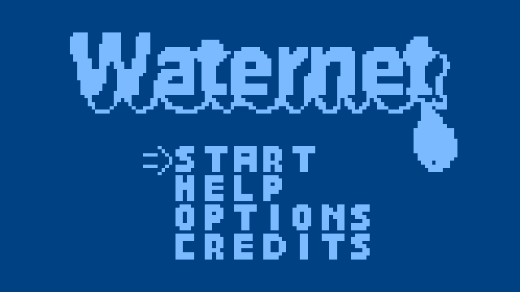
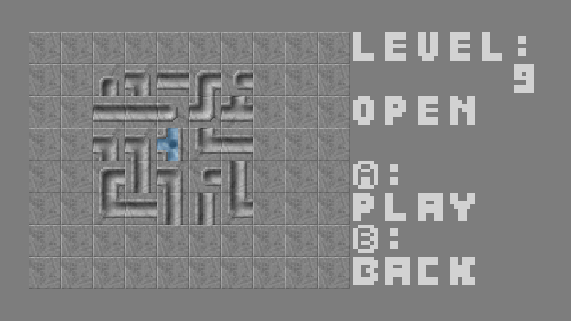
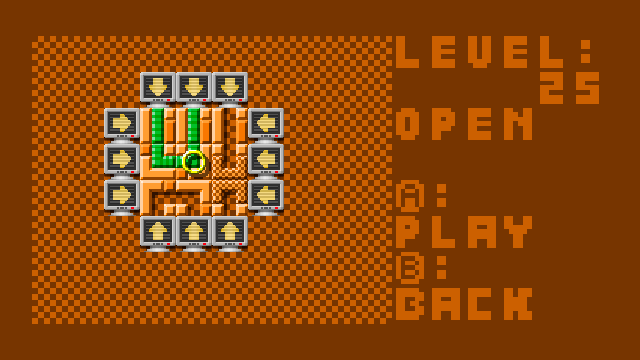

# Waternet Vircon32 Version
Waternet is a multiplatform puzzle game written for old consoles and handhelds like Game Boy (Color), Game Gear, Master System, Analogue Pocket and Mega Duck and now also Vircon32 !

## Screenshots

## Vircon32 Game Features:
- 3 Game modes (Rotate, Slide, RoSlid)
- 5 Difficulties per game mode (very easy, easy, normal, hard, very hard)
- 25 Levels per difficulty
- Unlimited random levels mode, per game mode
- 4 Skins to choose from
- 2 Text options to choose from
- Autosaves progress

## Playing the Game:
The aim of the game, in any game mode is always to connect all pipes so that water can flow through them from the water point source. How you can accomplish this depends on the game mode. The game has a help section in the main menu where you can always check up on the rules of each game mode. The game has 375 levels, spread over 3 game mode each with 5 difficulties, so thats 25 levels per difficulty / game mode. To top that off the game also provides a random difficulty which will generate never ending, random levels for the game mode you had chosen.

## Game Modes
The Game has 3 game modes

### Rotate Mode
You need to connect all the pipes so water flows through them, by pressing the A button on a pipe, to rotate the single pipe.

### Slide Mode
You need to connect all the pipes so water flows through them, by pressing the A  button on the arrows of a row or column. The row or column will move all pipes in the direction the arrow is pointing at.

### Roslid Mode
You need to connect all the pipes so water flows through them, by pressing the A button on the arrows of a row or column. The row or column will move all pipes in the direction the arrow is pointing at. You can also press the A button on a pipe, to rotate the single pipe. This is a combination Rotate and Slide mode.

## Controls

| Button | Action |
| ------ | ------ |
| Dpad | Select menu's, options or levels to play. During gameplay move the selector tile around. The crank in slide mode will only move around the arrow keys so you can quickly slide in the correct direction by pressing the (A)ction button, in other game modes it will loop through all possible selections. |
| A | Confirm in menu and level selector, rotate or slide action while playing |
| B | Back in menu, level selector and game |
| R | Select Next Skin anywhere in the game |

## Credits
The Game Concept is based on net and netslide games from the [simon tatham's puzzle collections](https://www.chiark.greenend.org.uk/~sgtatham/puzzles/)

"FP_Aquaeduct" skin from the gp2x colored version created by Fusion Power

"FP_Brixx" skin from the gp2x colored version, which was a small tribute to Sonic 2 "Emerald Hill" Stage and also created by Fusion Power