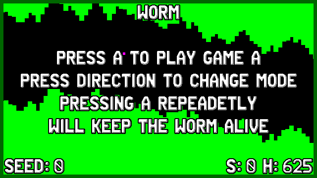
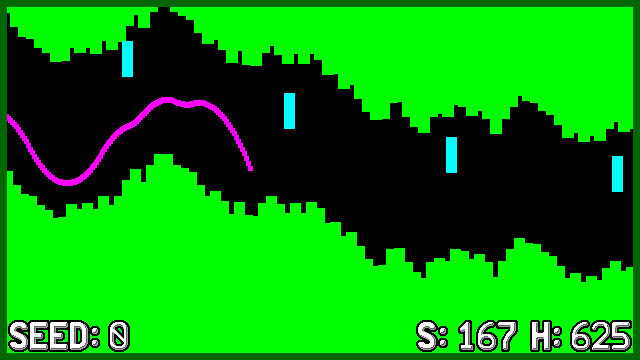

# Worm Vircon32
  

This is my [Vircon32 fantasy console](http://www.vircon32.com/) worm game, which is a remake of the classic copter / worm game with multiple gameplay modes

## Controls

| Key        | Action                                        |
|------------|-----------------------------------------------|
| A          | Start GAME, Repeadetly tap to move Worm       |
| LEFT/RIGHT | Select Game Mode on Titlescreen               |
| L/B        | Select Seed, increases by 15 when hold        |
| START      | Holding Start for half a second resets scores |

## Aim of the game
Repeadetly Press / hold A button to move the worm around, dont hit obstacles and walls, try to gain highest score.

## Seed System
The game has a seed system, you can choose a number between 0 and 9999 for the seed.
Selecting seed 0 will produce random levels on ever (re)start, but selecting any higher number will make sure the level is the same for anyone playing on the same game mode and with the same seed

## Game Modes
There are 5 Game modes to play on, each with their own specifics

### Mode A
- decreasing space for the worm to move in
- 5 obstacles
- Constant slower speed

### Mode B
- Fixed space for the worm to move in
- No obstacles
- Increasing speed

### Mode C
- Fixed space for the worm to move in
- 2 obstacles
- Increasing speed 

### Mode D
- Decreasing space for the worm to move in
- No obstacles
- Increasing speed

### Mode E
- Pacman mode: Collect the yellow squares, missing one is game over
- Fixed space for the worm to move in
- No obstacles
- Constant slower speed

## Credits
The game was made possible after watching this youtube movie: [https://www.youtube.com/watch?v=W-3okcjOFnY](https://www.youtube.com/watch?v=W-3okcjOFnY)

## License
* License of my part of game's code is MIT
* Game uses DrawPrimitives and TextFonts from [@vircon32](https://www.github.com/vircon32) in libs dir it's license is 3-Clause BSD License.
* game uses a font Asset (TextureFont22x32.png) created by [@vircon32](https://www.github.com/vircon32) provided under CC BY 4.0 License
